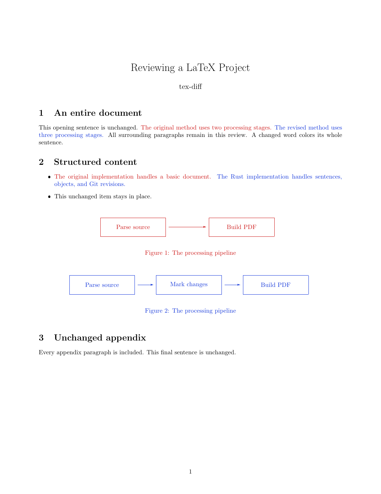

# tex-diff

Review LaTeX source changes in a Git project as a PDF of the whole document. Removed
sentences and objects are red; additions are blue. Run `tex-diff` to build the
review and open it in your PDF viewer.

Original text and drawing colors retain their hue with reduced saturation, and
imported graphics are faded. Links, citations, and linked references keep their
original colors. This applies to both review modes.



[Unified PDF example](examples/review.pdf) ·
[Side-by-side PDF example](examples/side-by-side.pdf)

## Installation

Requirements:

- Rust 1.90 or later to build and install.
- Git, `latexmk`, and a LaTeX distribution with `xcolor` and a kernel from
  October 2020 or later.
- pdfLaTeX, XeLaTeX, or LuaLaTeX.
- BibTeX for documents with classic bibliographies.

Install from this checkout:

```sh
cargo install --path . --locked
tex-diff --doctor
```

Then run it in your LaTeX repository:

```sh
cd /path/to/your/latex-project
tex-diff
```

The default comparison shows unstaged changes. Use `tex-diff HEAD` to review all
changes since the latest commit, including staged changes.

## Review modes

```sh
tex-diff --mode unified
tex-diff --mode side-by-side
```

Unified is the default. Removed and added sentences appear together in one
complete document. It uses the newer version's preamble and repaginates as
removed content is inserted.

Side by side places the old version on the left and the new version on the
right in a single PDF. Each version keeps its page count, numbering, and content
on each page. Old page 1 is paired with new page 1, and so on; if one version has
fewer pages, the remaining column is blank. Searchable text and vector artwork
are preserved; interactive PDF links and annotations are omitted.

A changed word marks its whole sentence. Figures, tables, and display math are
compared as complete objects; changed images get a colored frame. Inline math
stays with its sentence. Comments and ordinary line wrapping are ignored.

## Saving and opening PDFs

By default, the PDF is kept in a unique system temporary directory (`/tmp` on
Linux). Its path is printed, and the file remains available after the command
exits.

```sh
tex-diff --save
tex-diff --output review.pdf
tex-diff --no-open --output review.pdf
```

`--save` writes `tex-diff.pdf` in your current directory. `--output` chooses a
custom path and takes precedence over `--save`. Both modes open the PDF
automatically; `--no-open` skips the viewer.

Choose a viewer with `--viewer /path/to/pdf-reader` or `TEX_DIFF_VIEWER`. On Linux
without a desktop display, the command prints the PDF path so you can open it
later.

## Choosing revisions and documents

| Command | Before | After |
| --- | --- | --- |
| `tex-diff` | Index (staged snapshot) | Working tree |
| `tex-diff --staged` | HEAD | Index |
| `tex-diff --staged REV` | REV | Index |
| `tex-diff REV` | REV | Working tree |
| `tex-diff OLD NEW` | OLD | NEW |
| `tex-diff OLD..NEW` | OLD | NEW |
| `tex-diff OLD...NEW` | Merge base of OLD and NEW | NEW |

`--cached` is an alias for `--staged`. Omitted range endpoints default to HEAD.
The working snapshot includes non-ignored untracked files.

The main `.tex` file is discovered automatically. If the repository contains
multiple documents, select one with `--main` or after `--`:

```sh
tex-diff HEAD --main paper.tex
tex-diff --staged --mode side-by-side -- paper.tex
tex-diff v1 v2 --old-main old.tex --main new.tex
```

File paths are relative to your current directory. Git branches and the index
are left unchanged. Resolve any index merge conflicts before running a review.

## LaTeX engines and compatibility

The default engine is pdfLaTeX. A `% !TEX program = xelatex` or `lualatex` comment
near the beginning of the main file selects that engine. Choose explicitly or
check an engine's installation with:

```sh
tex-diff --engine xelatex
tex-diff --doctor --engine xelatex
```

Use UTF-8 source files and keep project-local inputs and assets inside the
repository. Local `\input`, `\include`, and import-family commands are followed.
Local classes and packages, including `mathpartir`, are preserved and take
precedence over installed files with the same name.

Simple macro definitions are expanded. For macros that require TeX execution,
the comparison tracks changes to their used definitions and prints a note.
Conditionals, catcode changes, generated text, counter-dependent macros, and
changes limited to class styling may need manual review.

Classic BibTeX bibliographies are supported, including changes to cited entries.
`biblatex`/Biber, multiple bibliographies, Git submodules, external project
inputs, custom build scripts, and shell-escape workflows are unsupported.
Compilation uses `latexmk` without rc files or shell escape.

If preamble changes make old content incompatible with the newer version, use
side-by-side mode so each version compiles with its own configuration.

## Exporting source and reports

```sh
tex-diff --tex-output review.tex --report review.json --no-open
tex-diff --no-pdf --tex-output review.tex
```

`--tex-output` exports complete unified LaTeX source in either review mode,
alongside a `tex-diff-assets-...` directory with resources and compilable sources
under `old/`, `new/`, and `unified/`. Keep that directory with the review. These
sources preserve the original master paths and `\jobname`; use them if the
document depends on its original filename.

`--no-pdf` skips PDF compilation and viewer launch. BibTeX is still required
when resolving bibliography entries. Source export protects existing original
LaTeX files from being overwritten.

`--report` writes JSON with revision labels, change counts, and changed units.
Locations use repository-relative paths and 1-based line and column numbers.

For scripts, add `--exit-code`: changes return 1, no changes return 0, and errors
return 2. Without that flag, successful reviews return 0.

## Troubleshooting

```sh
tex-diff --doctor
tex-diff --keep-build --timeout 180
tex-diff --help
```

LaTeX runs in nonstop mode to report errors beyond the first one. Compilation
errors are shown with source context; the full log stays in the build directory.
Failed runs retain build files and logs and print their location. `--keep-build`
also retains them after success. The default timeout is 120 seconds for source
comparison and for each compilation.

A failed comparison or compilation leaves existing output files intact. If a
viewer fails to start, the generated PDF remains available at the printed path.

## Development

```sh
cargo fmt --check
cargo clippy --locked --all-targets -- -D warnings
cargo test --locked --all-targets
```

Integration tests require Git, all three LaTeX engines, and Poppler's
`pdftotext` and `pdftoppm`.

## License

[MIT](LICENSE).
